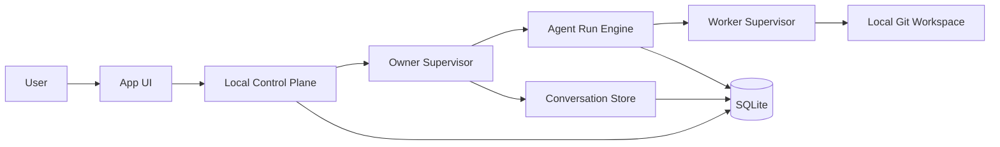
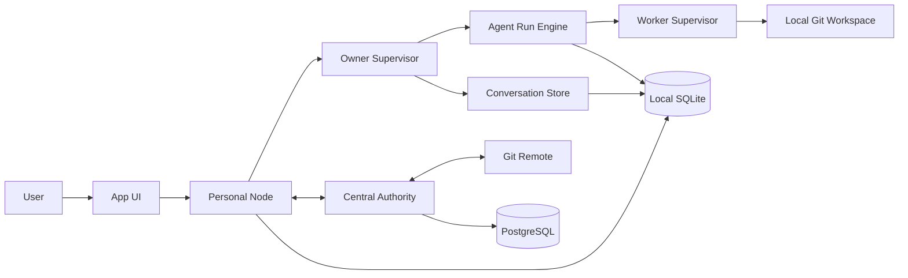

# System Context

관련 결정:

- [[07 ADR/ADR-0005 Personal and Team Runtime Topology]]
- [[07 ADR/ADR-0006 Owner Runtime and Agent Runs]]

## 개인 모드

개인 모드에서는 Local Control Plane이 개인 프로젝트 상태, Work Item, Task, Task Attempt, 로컬 승인, 로컬 병합, 실행 로그와 실패 복구를 관리한다. 별도의 중앙 Authority 서버는 필요하지 않다.

## 팀 모드

팀 모드에서는 각 사용자가 자신의 Personal Node를 가진다. 팀 프로젝트의 공식 공유 상태는 중앙 Authority가 관리한다.

Owner Agent Run과 Worker 실행은 다른 생명주기를 가진다. Agent Run은 사용자 요청, 승인 대기, Worker 결과 대기와 재개를 관리하고, Worker Supervisor는 Task Attempt의 실제 실행과 로그, 아티팩트를 관리한다.

## 중앙 Authority 책임

- Workspace, Project, Membership, Permission
- 공식 Work Item과 Task
- Lease와 Scope Lock
- Change Package 검증
- 프로젝트별 Merge Queue
- 공식 Decision과 Approval
- Audit Event와 Reconciliation

## 개인 Node 책임

- 개인 Owner 대화와 메모리
- Agent Run, Run Step, Tool Call과 승인 대기 상태
- 로컬 Worker 실행
- 로컬 Git Worktree와 테스트
- Inbox/Outbox
- 오프라인 작업 보관
- Change Package 생성과 제출

## 데이터 소유권 경계

- 개인 프로젝트 상태는 Local Control Plane이 소유한다.
- 팀 프로젝트의 공식 공유 상태는 중앙 Authority가 소유한다.
- 개인 Owner 대화와 개인 메모리는 Personal Node가 소유한다.
- 코드와 Commit 이력은 Git이 소유한다.
- 개인 Node의 중앙 프로젝트 정보는 캐시이며, 개인 Node는 중앙 DB의 동등한 Writer가 아니다.
