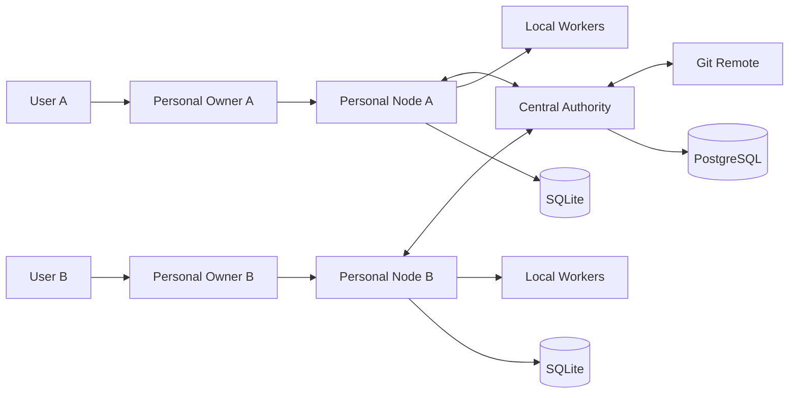

# System Context

## 중앙 Authority 책임

- Workspace, Project, Membership, Permission
- 공식 Work Item과 Task
- Lease와 Scope Lock
- Change Package 검증
- 프로젝트별 Merge Queue
- 공식 Decision과 Approval
- Audit Event와 Reconciliation

## 개인 Node 책임

- 개인 Owner 대화와 메모리
- 로컬 Worker 실행
- 로컬 Git Worktree와 테스트
- Inbox/Outbox
- 오프라인 작업 보관
- Change Package 생성과 제출
