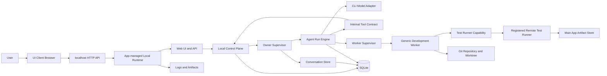
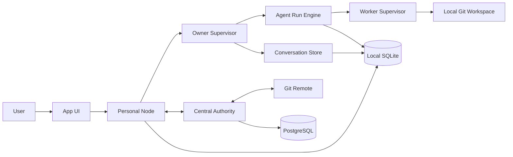

# System Context

관련 결정:

- [[07 ADR/ADR-0005 Personal and Team Runtime Topology]]
- [[07 ADR/ADR-0006 Owner Runtime and Agent Runs]]
- [[07 ADR/ADR-0008 Personal Mode MVP and Deployment]]
- [[07 ADR/ADR-0009 Personal Mode Core Data Model and State Machines]]
- [[07 ADR/ADR-0010 Owner Tool Contract and Local Control Plane API]]
- [[07 ADR/ADR-0011 Personal Runtime, Account, Device, and Session Model]]
- [[07 ADR/ADR-0012 Remote Test Runner Worker Capability]]
- [[07 ADR/ADR-0013 MVP Implementation Slice and Repository Strategy]]

## 개인 모드

v2 구현은 별도 Public Monorepo `ai-development-platform`에서 시작한다.

```text
apps/server          = App-managed Local Runtime와 FastAPI
apps/web             = Desktop-ready Web UI
apps/runner-agent    = 후반 Slice의 Remote Test Runner Agent
packages/shared-contracts = API/Tool schema와 shared types
packages/cli-adapters     = 외부 Agent Process Adapter contracts
```

Owner와 Worker는 도메인 역할이고 Codex CLI와 Antigravity CLI는 초기 외부 Agent Process Adapter다. 플랫폼은 외부 CLI의 내부 상태를 소유하지 않으며 process input, working directory, environment, stdout/stderr, exit status, artifact와 Git 결과를 실행·관찰·기록한다.

Ubuntu Desktop을 primary runtime target으로, Windows를 development/compatibility target으로 둔다. Windows 지원을 제거하지 않으며 OS Path Resolver와 Process Runner가 native OS 차이를 격리한다.

개인 모드의 UI와 서버 경계는 다음과 같다.

```text
UI Shell
→ Local Transport
→ App-managed Local Runtime
→ SQLite / Git / Worker Supervisor / Artifact Store
```

초기 MVP는 Desktop App Shell에 재사용할 수 있는 browser-accessible Web UI가 localhost HTTP API를 호출한다. 장기적으로 Desktop App Shell이 같은 local HTTP API 또는 후속 IPC로 App-managed Local Runtime에 연결한다.



Tool Contract는 서버 내부 업무 처리 규칙이고 HTTP API는 UI Shell이나 다른 클라이언트가 application service를 호출하는 transport다. Owner Agent Run은 같은 서버 안에서 Internal Tool Contract를 통해 Local Control Plane을 호출하므로 HTTP를 반드시 거칠 필요가 없다.

`Primary Personal Server`는 내부 배치 용어로 유지할 수 있지만 별도 서버 제품이 아니다. 제품 UX는 앱이며 Desktop App이 장기적으로 Local Runtime을 시작하고 관리한다. Local Runtime은 Local Control Plane, Owner Runtime, Agent Run Engine, Worker Supervisor, SQLite, Git Worktree와 Artifact Store를 실행한다.

Remote Test Runner는 Local Runtime 외부의 실행 환경이다. Owner가 직접 호출하지 않고 Worker가 Task Attempt 범위에서 Test Runner Capability로 사용한다. Runner는 test/build/lint만 실행하고 산출물을 Main App Artifact Store에 업로드한다. Worker가 artifact를 분석해 Worker Report를 제출하고 Owner는 Report와 필요 시 원본 artifact를 검토한다.

Tailscale은 기본 앱 접속 전제가 아니라 Remote Test Runner에 도달하기 위한 선택적 사설 네트워크 후보다. LAN과 SSH tunnel 등으로 대체할 수 있어야 하며 인터넷 직접 공개는 기본값이 아니다.

개인 모드에서는 Local Control Plane이 개인 프로젝트 상태, Work Item, Task, Task Attempt, 로컬 승인, 로컬 병합, 실행 로그와 실패 복구를 관리한다. 별도의 중앙 Authority 서버는 필요하지 않다.

Project는 여러 ProjectRepository를 가질 수 있다. Personal Mode MVP의 작업 실행은 primary repository 중심으로 시작하지만, 공통 도메인 모델은 multi-repository project를 막지 않는다. cross-repository atomic merge와 multi-repo merge orchestration은 MVP 범위가 아니다.

Owner LLM은 SQLite, Git, 파일시스템 또는 Worker를 직접 조작하지 않는다. 모든 관찰과 변경은 Local Control Plane이 제공하는 Tool Call을 통하며, 실행 전에 Owner Grant와 Approval Policy를 평가하고 실행 후 Runtime Event와 Audit Event를 남긴다.

Worker는 Owner가 만든 repository-scoped Task만 격리된 Worktree에서 실행한다. 작업 브랜치에 결과를 자동 commit하지만 기본 브랜치에 직접 병합하지 않는다. Owner 검토와 승인 정책을 통과하고 사용자가 승인한 결과만 squash merge한다.

Primary Personal Server Runtime은 Windows와 Linux 지원을 목표로 설계한다. 첫 개발, 통합 테스트와 실제 운영 기준 환경은 Ubuntu reference environment다.

Runtime 핵심 로직은 운영체제에 종속되지 않는다. 운영체제별 경로 해석, 명령 실행, 서비스 설치와 백그라운드 실행은 Adapter로 분리한다.

UI Shell과 연결된 Device Session은 프로젝트 상태의 원본이 아니다. 개인 모드 MVP의 공식 실행 상태 원본은 App-managed Local Runtime의 SQLite다.

## 팀 모드



팀 모드에서는 각 사용자가 자신의 Personal Node를 가진다. 팀 프로젝트의 공식 공유 상태는 중앙 Authority가 관리한다.

Personal Node의 로컬 Tool Call은 로컬 Tool Contract와 Policy Engine으로 처리할 수 있다. 공식 승인, 중앙 Merge Queue 등록과 공식 merge 같은 팀 공유 상태 변경은 Central Authority API를 통과하고 PostgreSQL에 기록한다.

Owner Agent Run과 Worker 실행은 다른 생명주기를 가진다. Agent Run은 사용자 요청, 승인 대기, Worker 결과 대기와 재개를 관리하고, Worker Supervisor는 Task Attempt의 실제 실행과 로그, 아티팩트를 관리한다.

## 중앙 Authority 책임

- Workspace, Project, Membership, Permission
- 공식 Work Item과 Task
- Lease와 Scope Lock
- Change Package 검증
- 프로젝트별 Merge Queue
- 공식 Decision과 Approval
- Audit Event와 Reconciliation

## 개인 Node 책임

- 개인 Owner 대화와 메모리
- Agent Run, Run Step, Tool Call과 승인 대기 상태
- 로컬 Worker 실행
- 로컬 Git Worktree와 테스트
- Inbox/Outbox
- 오프라인 작업 보관
- Change Package 생성과 제출

## 데이터 소유권 경계

- 개인 프로젝트 상태는 Local Control Plane이 소유한다.
- 팀 프로젝트의 공식 공유 상태는 중앙 Authority가 소유한다.
- 개인 Owner 대화와 개인 메모리는 Personal Node가 소유한다.
- 코드와 Commit 이력은 Git이 소유한다.
- 개인 Node의 중앙 프로젝트 정보는 캐시이며, 개인 Node는 중앙 DB의 동등한 Writer가 아니다.
