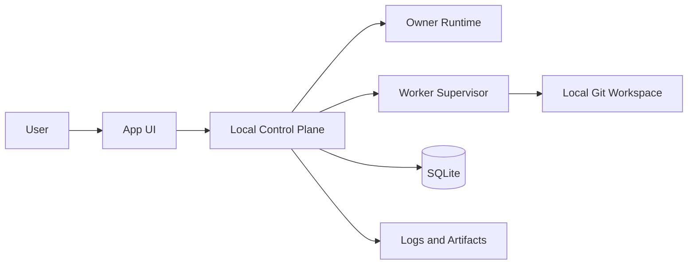
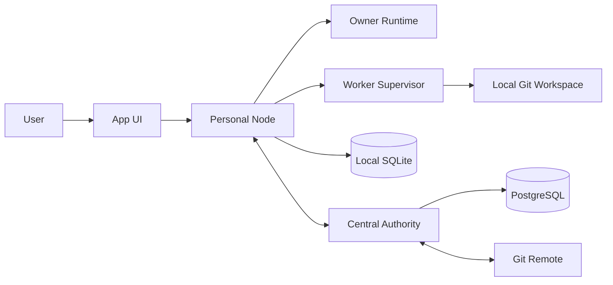

# ADR-0005: 개인 모드와 팀 모드의 Runtime Topology

## 배경

이 제품은 개인 개발자가 혼자 사용하는 경우와 여러 사용자가 팀 프로젝트를 운영하는 경우를 모두 지원한다. 기존 결정은 공유 프로젝트 상태를 중앙 Authority가 관리하고, 각 사용자가 개인 Owner를 가진다는 원칙을 확정했다.

관련 결정:

- [[07 ADR/ADR-0001 Central Authority]]
- [[07 ADR/ADR-0002 Personal Owner]]
- [[07 ADR/ADR-0004 Governance and Approval Policy]]

## 문제

개인 모드와 팀 모드를 별개의 제품처럼 설계하면 사용자 경험, 도메인 모델, Owner와 Worker 개념이 갈라진다. 반대로 모든 실행 프로세스와 데이터베이스를 하나로 합치면 개인 사용, 팀 협업, 오프라인 작업, 중앙 권위 상태의 경계가 흐려진다.

따라서 하나의 제품과 하나의 UI를 유지하면서도 실행 위치와 데이터 소유권을 모드별로 분리해야 한다.

## 결정

개인 모드와 팀 모드는 별개의 제품이 아니다. 하나의 앱, 하나의 프론트엔드 코드베이스, 공통 도메인 모델, 공통 Owner 및 Worker 개념을 사용한다.

프로젝트 종류에 따라 연결 대상, 실행 위치, 데이터 저장소가 달라진다.

- 개인 프로젝트: App UI가 Local Control Plane에 연결된다.
- 팀 프로젝트: App UI가 사용자의 Personal Node와 중앙 Authority에 연결된다.

개인 모드에서는 별도의 중앙 Authority 서버가 필요하지 않다. 팀 모드의 공식 공유 상태는 중앙 Authority가 관리한다. 개인 Node는 중앙 Authority DB의 복제본이나 동등한 Writer가 아니다.

## 공통 제품 구조

공통 구조:

- 하나의 앱
- 하나의 프론트엔드 코드베이스
- 공통 도메인 모델
- 공통 Owner 개념
- 공통 Worker 개념
- 프로젝트 종류에 따른 실행 위치와 데이터 저장소 분리

사용자가 보는 UI는 하나지만, 내부 프로세스와 데이터베이스는 실행 모드에 따라 달라질 수 있다.

## 개인 모드 실행 구조

개인 모드는 팀 모드의 공통 핵심 기능에서 팀 전용 기능을 제거하거나 숨긴 형태다.

기본 구성:

- 하나의 사용자 앱
- Local Control Plane
- Personal Owner Runtime
- Worker Supervisor
- SQLite
- Local Git Workspace
- 로그와 아티팩트
- 승인 UI

Local Control Plane의 책임:

- 개인 프로젝트 상태 관리
- Work Item과 Task 관리
- Task Attempt 관리
- Worker 실행 조정
- 로컬 승인
- 로컬 병합
- 실행 로그 관리
- 실패 복구

개인 모드의 사용자는 자동으로 Admin이다.

개인 모드에서 숨기거나 비활성화할 팀 전용 기능:

- 팀원 초대
- 프로젝트 멤버십
- Approval Group
- 여러 사용자 간 권한 관리
- 여러 개인 서버 간 Lease와 Scope Lock
- 중앙 Merge Queue
- 팀 감사 로그
- 중앙 Authority 연결

## 팀 모드 실행 구조

팀 모드에서는 각 사용자가 자신의 Personal Node를 가진다.

각 Personal Node에는 다음이 존재한다.

- 개인 Owner Runtime
- Worker Supervisor
- Local Git Workspace
- 로컬 SQLite
- 중앙 서버 이벤트 Inbox
- 중앙 서버 명령 Outbox
- 로컬 실행 로그
- 오프라인 작업 상태

팀 프로젝트의 공식 공유 상태는 중앙 Authority가 관리한다.

중앙 Authority의 기본 구성:

- Project Membership
- 공유 Work Item과 Task
- Task Lease
- Scope Lock
- Approval Policy
- Decision Proposal
- Change Package
- Merge Coordinator
- Audit Event
- PostgreSQL

## 하나의 앱 원칙

사용자에게는 하나의 앱과 하나의 UI를 제공한다.

하나의 앱이라는 것은 모든 프로세스와 DB를 하나의 실행 파일에 넣는다는 의미가 아니다. 하나의 사용자 경험과 프론트엔드를 제공하지만 내부 실행 위치는 분리될 수 있다.

프로젝트에 따라 앱의 연결 대상이 달라진다.

- 개인 프로젝트: Local Control Plane
- 팀 프로젝트: Personal Node와 중앙 Authority

## 로컬 실행

사용자의 노트북이나 데스크톱 한 대에서 다음을 모두 실행할 수 있다.

- UI
- Local Control Plane
- Owner Runtime
- Worker Supervisor
- SQLite
- Git Workspace

## 원격 개인 서버 실행

사용자 노트북은 UI Client 역할을 할 수 있다.

개인 Ubuntu 서버 또는 다른 실행 컴퓨터에서 다음을 실행할 수 있다.

- Local Control Plane
- Owner Runtime
- Worker Supervisor
- SQLite
- Git Workspace

사용자 화면에서는 내부 용어 `Node`보다 다음 표현을 우선 사용한다.

- 이 컴퓨터
- 개인 서버
- 실행 서버
- 연결된 장치

내부 도메인과 API에서는 `Node`라는 용어를 사용할 수 있다.

## 데이터 소유권

개인 프로젝트 상태는 Local Control Plane이 소유한다.

팀 프로젝트의 공식 공유 상태는 중앙 Authority가 소유한다.

개인 Owner 대화와 개인 메모리는 Personal Node가 소유한다.

코드와 Commit 이력은 Git이 소유한다.

개인 Node의 중앙 프로젝트 정보는 캐시다. 개인 Node는 중앙 DB의 동등한 Writer가 아니다.

## 데이터베이스 경계

개인 모드:

- SQLite 사용
- 한 사용자 중심의 로컬 데이터 저장
- Owner 대화
- 개인 메모리
- Work Item
- Task
- Task Attempt
- Worker 실행
- 승인
- 로컬 Change Package
- 설정

팀 모드의 Personal Node:

- 로컬 SQLite 유지
- Owner 대화
- 개인 메모리
- 로컬 Worker 실행
- Inbox와 Outbox
- 오프라인 작업
- 중앙 상태 캐시
- 제출 전 Change Package

팀 모드의 중앙 Authority:

- PostgreSQL 사용
- 공유 프로젝트 상태의 유일한 원본
- 멤버십
- Task Lease
- Scope Lock
- Change Package
- Approval Policy
- Merge Queue
- Audit Event

SQLite 파일을 중앙 DB처럼 네트워크로 공유하지 않는다.

개인 SQLite와 중앙 PostgreSQL을 양방향 테이블 복제하지 않는다.

## Owner 및 Worker 실행 위치

Owner는 사용자별 Personal Node에서 실행한다.

Worker는 사용자의 실행 환경에서 Worker Supervisor가 조정한다. 사용자는 Worker를 직접 조작하지 않는다.

## 중앙 Authority의 역할

중앙 Authority에는 초기 버전에서 필수 중앙 AI를 두지 않는다.

중앙 Authority는 규칙 기반으로 다음을 수행한다.

- 권한 검사
- Lease와 Lock 관리
- Change Package 검증
- Approval Policy 집행
- Merge Queue 실행
- 상태 복구

중앙 AI는 미래에 선택적인 Coordination Advisor로 추가할 수 있다. 이 경우에도 공식 상태를 독단적으로 변경하지 않는다.

## 네트워크 단절과 재연결

Personal Node가 중앙 Authority와 연결되지 않은 동안 가능한 작업:

- Owner와 대화
- 이미 받은 Task 계속 수행
- 로컬 코드 수정
- 로컬 테스트
- 제출 대기 Change Package 생성

연결되지 않은 동안 불가능한 작업:

- 새 공식 Lease 획득
- 새 공유 Scope Lock 획득
- 공식 프로젝트 결정 확정
- 다른 사용자의 작업 상태 변경
- 공식 브랜치 병합
- 프로젝트 멤버십과 권한 변경

재연결 후 중앙 상태와 Lease, base commit을 다시 확인한다.

## 장점

- 개인 모드와 팀 모드를 하나의 제품 경험으로 유지한다.
- 개인 사용자는 중앙 Authority 없이 시작할 수 있다.
- 팀 프로젝트의 공식 공유 상태는 중앙 Authority가 일관되게 관리한다.
- Personal Node와 중앙 Authority의 데이터 소유권 경계를 명확히 한다.
- 로컬 실행과 원격 개인 서버 실행을 같은 도메인 모델로 설명할 수 있다.

## 단점

- 하나의 UI가 여러 연결 대상을 다뤄야 한다.
- 개인 모드와 팀 모드의 기능 숨김과 상태 전이가 필요하다.
- Personal Node 캐시와 중앙 Authority 원본 상태의 차이를 사용자에게 과도하게 노출하지 않도록 설계해야 한다.
- 오프라인 작업 후 재연결 검증과 충돌 처리가 필요하다.

## 후속 과제

- Node 등록과 인증 방식 정의
- Owner Runtime 내부 구조 정의
- Owner 자동 병합과 완전 자동 실행 범위 정의
- Approval Policy 위험도와 승인 수 정의
- 데스크톱 앱 포장 방식 정의
- 새 v2 저장소의 실제 생성 및 마이그레이션 방식 정의
