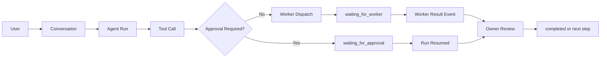

# ADR-0006: Owner Runtime과 Agent Run

## 배경

[[07 ADR/ADR-0002 Personal Owner]]는 각 사용자가 개인 Owner를 가진다고 결정했다. [[07 ADR/ADR-0005 Personal and Team Runtime Topology]]는 Owner가 사용자별 Personal Node에서 실행된다고 결정했다. Owner 자율성과 위험 기반 승인 정책은 [[07 ADR/ADR-0007 Autonomy and Approval Risk Policy]]에서 다룬다. 개인 모드 MVP의 CLI-first Model Provider Adapter와 백그라운드 실행 범위는 [[07 ADR/ADR-0008 Personal Mode MVP and Deployment]]에서 구체화한다.

이제 Owner Runtime 내부를 하나의 영구 LLM 세션으로 볼지, 요청별 실행 단위로 볼지, 승인 대기와 Worker 결과를 어떻게 복구 가능한 상태로 다룰지 결정해야 한다.

## 문제

Owner를 하나의 영구 LLM 세션이나 무한 실행 프로세스로 보면 다음 문제가 생긴다.

- 앱이나 Personal Node 재시작 후 미완료 작업 복구가 어렵다.
- 승인 대기, Worker 결과 대기, Tool 실패를 명확한 상태로 저장하기 어렵다.
- 외부 부작용을 일으킨 Tool Call을 재개 중 중복 실행할 위험이 커진다.
- Conversation 메시지, 실행 상태, 장기 Memory가 한 덩어리로 섞인다.
- 모델 공급자나 Prompt, Tool 정의 변경을 Run 단위로 추적하기 어렵다.

반대로 모든 요청을 완전히 독립적인 일회성 호출로만 보면 긴 Conversation의 맥락, 승인 후 재개, Worker 결과 검토, 실패 복구가 약해진다.

## 결정

Owner는 하나의 영구 LLM 세션이나 하나의 무한 실행 프로세스가 아니다.

Owner는 사용자별 Personal Node에서 실행되는 다음 요소로 구성된 실행 시스템이다.

- Owner Supervisor
- Conversation
- Message
- Agent Run
- Agent Run Step
- Tool Call
- Approval Interruption
- Memory
- Model Provider Adapter
- Event Stream

Owner Supervisor는 장기 서비스다. 실제 AI 작업은 제한된 목적을 가진 Agent Run으로 실행한다. Agent Run 상태는 저장되며 승인, Worker 결과, 오류 복구 후 재개될 수 있다.

## Owner Supervisor

Owner Supervisor는 Personal Node에서 실행되는 장기 서비스다.

책임:

- 사용자 요청 수신
- Conversation 관리
- Agent Run 생성
- 실행 Queue 관리
- Run 중단, 재개, 취소와 재시도
- Approval 대기 관리
- Worker 작업 제출과 결과 대기
- 오류 복구
- 진행 이벤트 발행
- 사용 모델과 도구 정책 적용

Owner Supervisor 자체가 하나의 계속 이어지는 AI 대화는 아니다. 프로세스가 재시작되어도 저장된 DB 상태를 바탕으로 미완료 Run을 복구해야 한다.

## Conversation과 Message

Conversation은 사용자와 개인 Owner 사이의 장기 대화 단위다.

Conversation은 여러 Agent Run을 포함할 수 있다.

예:

- 사용자가 기능 개발을 요청한 Run
- Owner가 결과를 검토한 Run
- 추가 질문에 답한 Run
- 병합을 준비한 Run

Conversation의 메시지 기록과 Agent Run 실행 상태는 분리한다.

Conversation 후보 필드:

- conversation_id
- user_id
- project_id
- title
- status
- created_at
- updated_at

Message 후보 필드:

- message_id
- conversation_id
- actor_type
- actor_id
- content
- created_at
- related_run_id
- attachment_refs

## Agent Run

Agent Run은 하나의 명확한 사용자 요청 또는 시스템 목적을 처리하는 제한된 실행 단위다.

예:

- 기능 요구 분석
- 작업 계획 작성
- Worker Task 생성
- Worker 결과 검토
- Decision Proposal 작성
- 병합 준비
- 사용자 질문 응답

Agent Run은 Conversation 전체와 같지 않다. 각 Run은 고유한 입력, 상태, 권한, 모델 설정, 결과와 실행 이력을 가진다.

상태 후보:

- queued
- preparing
- running
- waiting_for_approval
- waiting_for_user
- waiting_for_worker
- retry_scheduled
- completed
- failed
- cancelled

상태 이름은 설계 후보로 기록한다. 구체적인 상태 전이 전체는 이 ADR에서 확정하지 않는다.

**Decision Boundary and Planning Responsibility**:
Owner AgentRun is responsible for interpretation and planning. The application records and executes Tool Calls, but does not replace Owner reasoning with hardcoded keyword routing. (See ADR-0019)

**Owner Runtime Provider**:
Owner AgentRuns are executed through an Owner Runtime Provider. The initial MVP provider is Codex CLI, but the Owner Runtime model remains provider-agnostic.

## Agent Run Step

Agent Run은 여러 Step으로 구성될 수 있다.

Step 예:

- context_load
- model_call
- tool_call
- worker_dispatch
- worker_result_review
- approval_request
- decision_record
- final_response

Step 후보 필드:

- step_id
- run_id
- sequence
- type
- status
- input_ref
- output_ref
- started_at
- completed_at
- error

Run 재개 시 이미 성공한 외부 작업을 무조건 다시 실행하지 않는다.

## Tool Call

LLM은 시스템 상태나 파일을 직접 임의 변경하지 않는다. 외부 부작용은 명시적으로 등록된 Tool을 통해서만 실행한다.

Tool 예:

- 프로젝트 상태 조회
- Task 생성
- Worker 작업 제출
- 파일 읽기
- Git 상태 조회
- 테스트 실행
- Change Package 제출
- Decision Proposal 생성
- 승인 요청 생성

Tool Call 후보 필드:

- tool_call_id
- run_id
- step_id
- tool_name
- arguments
- requested_permissions
- approval_requirement
- idempotency_key
- status
- result_ref
- error
- started_at
- completed_at

외부 상태를 변경하는 Tool Call에는 idempotency key를 사용한다.

## 승인 중단과 재개

Tool Call이 Approval Policy에 의해 승인을 요구하면 Run을 실패 처리하지 않는다.

승인 필요 여부, R0~R4 위험 등급, Owner Grant, stale 승인 처리는 [[07 ADR/ADR-0007 Autonomy and Approval Risk Policy]]를 따른다.

Run을 `waiting_for_approval` 상태로 전환하고 다음 정보를 저장한다.

- 현재 Run 상태
- 승인 대상 Tool Call
- 요청한 권한
- 인수 요약
- 위험도
- 승인 만료 시각
- 재개에 필요한 버전 정보

사용자가 승인하거나 거부하면 같은 Run을 이어서 실행한다. 승인 대기 중 앱이나 Personal Node가 재시작되어도 Run을 복구할 수 있어야 한다.

거부된 Tool Call은 거부 결과를 Owner에게 전달한다. Owner는 대안을 제시하거나 Run을 종료할 수 있다.

## Worker 실행과의 관계

Owner는 Worker 프로세스를 직접 내부 함수처럼 실행하지 않는다. Task 시스템을 통해 작업을 제출한다.

흐름:

1. Agent Run이 작업 필요성을 판단한다.
2. Owner가 Task 또는 Task Attempt 생성 요청을 한다.
3. Worker Supervisor가 적절한 Worker를 실행한다.
4. Agent Run은 `waiting_for_worker` 상태로 전환한다.
5. Worker 결과가 도착하면 새로운 이벤트로 Run을 재개한다.
6. Owner가 결과를 검토한다.
7. 추가 작업, 승인 요청 또는 완료를 결정한다.

Worker 실행과 Owner Agent Run 실행 상태는 분리한다. Worker가 실패해도 Owner Conversation 전체가 실패하지 않는다.

## Run State와 Memory 분리

다음을 서로 다른 개념으로 관리한다.

Run State:

- 현재 Agent Run을 재개하기 위한 실행 상태
- 현재 Step
- Tool Call 결과
- Approval 상태
- Worker 대기 상태
- 일시적인 작업 Context

Conversation History:

- 사용자와 Owner가 주고받은 메시지

Long-term Memory:

- 여러 Conversation과 Run에서 재사용하는 정보
- 사용자 선호
- 프로젝트 규칙
- 확정된 기술 선택
- 반복되는 작업 방식
- 요약된 과거 결과

장기 Memory에는 원본 대화 전체를 무조건 복사하지 않는다. Memory 생성과 변경은 출처를 추적할 수 있어야 한다.

## Context 구성

매 Agent Run에서 전체 대화와 전체 프로젝트 데이터를 모델에 모두 전달하지 않는다.

Run 시작 시 Context Builder가 필요한 정보만 조합한다.

- 현재 사용자 요청
- 최근 관련 메시지
- 프로젝트 공식 결정
- 관련 Work Item과 Task
- 필요한 코드 또는 문서 요약
- 사용자 및 프로젝트 Memory
- 사용 가능한 Tool
- 현재 권한 정책

긴 대화는 요약하거나 검색 가능한 형태로 관리한다. 원본 메시지는 삭제하지 않고 보존 정책에 따라 저장한다.

## Model Provider Adapter

Owner Runtime은 특정 AI 공급자나 모델에 결합하지 않는다.

Model Provider Adapter를 통해 다음을 교체할 수 있어야 한다.

- OpenAI
- Gemini
- 기타 호환 모델
- 로컬 모델

Run마다 모델과 설정을 기록한다.

- provider
- model
- prompt_version
- tool_definition_version
- runtime_version

중단된 Run을 나중에 재개할 때 도구나 Prompt 정의가 바뀌었는지 확인할 수 있어야 한다.

## 동시성

한 사용자의 Owner는 여러 Agent Run을 가질 수 있다.

다만 같은 프로젝트의 공식 상태를 변경하는 명령은 무제한 병렬 실행하지 않는다.

원칙:

- 읽기 전용 분석 Run은 병렬 가능
- 서로 독립된 프로젝트 Run은 병렬 가능
- 같은 프로젝트를 변경하는 명령은 Project Command Queue를 통해 순서 제어
- 같은 Task나 Change Package를 변경하는 명령에는 version 또는 idempotency 검사 적용

동시성 한도와 구체적인 Queue 정책은 후속 설계로 남긴다.

## 실패와 복구

실패를 다음처럼 구분한다.

- 일시적 모델/API 오류
- Tool 실행 오류
- Worker 실패
- 사용자 승인 거부
- 권한 부족
- 실행 버전 불일치
- 취소
- 복구 불가능 오류

재시도 가능한 오류만 자동 재시도한다. 재시도 횟수, backoff와 timeout의 구체적인 값은 이 ADR에서 확정하지 않는다.

실패한 Run의 기록을 삭제하거나 동일 Row를 처음 상태로 되돌리지 않는다. 재시도는 기존 Run의 재개 또는 별도 Attempt 기록으로 추적할 수 있어야 한다.

## UI 이벤트

Owner Runtime은 UI에 실행 진행 상황을 이벤트로 전달한다.

이벤트 예:

- run_created
- run_started
- model_output_streamed
- tool_call_requested
- approval_required
- worker_dispatched
- worker_progress
- run_resumed
- run_completed
- run_failed
- run_cancelled

초기 전송 방식은 SSE 또는 WebSocket 후보로 남기며 이 ADR에서 하나를 확정하지 않는다.

이벤트 전달이 끊겨도 DB의 공식 Run 상태는 유지되어야 한다.

## Durable Workflow 엔진 전략

초기 버전에서 Temporal, LangGraph 등의 외부 Workflow 엔진을 필수로 채택하지 않는다.

초기 구현은 SQLite 기반의 명시적 상태 머신, Run Step, Tool Call, Approval 상태와 체크포인트로 시작한다.

단, Owner Runtime의 Application 계층과 실행 저장소를 분리하여 향후 Durable Workflow 엔진으로 교체할 수 있게 한다.

외부 Workflow 엔진 채택 여부는 운영 복잡도와 복구 요구가 증가할 때 다시 검토한다.

## 데이터 모델 방향

개인 모드와 팀 Personal Node의 SQLite에는 다음 후보 데이터를 둘 수 있다.

- owner_conversations
- owner_messages
- agent_runs
- agent_run_steps
- tool_calls
- run_checkpoints
- owner_memories
- pending_approvals
- runtime_events

구체적인 최종 스키마, 인덱스, 보존 정책, 상태 전이 제약은 후속 설계로 남긴다.

## 장점

- Owner를 장기 서비스와 제한된 Agent Run으로 분리해 복구 가능성을 높인다.
- 승인 대기와 Worker 결과 대기를 실패가 아니라 명시적인 실행 상태로 다룬다.
- Conversation, Run State, Memory의 경계를 명확히 한다.
- Tool Call과 Step 기록으로 외부 부작용 중복 실행을 줄인다.
- 모델 공급자와 Workflow 엔진 선택을 나중에 바꿀 수 있다.

## 단점

- 단순한 단일 세션 구현보다 데이터 모델과 상태 관리가 복잡하다.
- Run, Step, Tool Call, Event 저장소가 필요하다.
- 재개 로직과 idempotency 설계가 초기부터 필요하다.
- UI는 스트리밍 이벤트와 DB의 공식 상태 차이를 함께 다뤄야 한다.

## 후속 과제

- 구체적인 Agent Run 상태 전이 정의
- 재시도와 timeout 값 정의
- 모델 선택 및 fallback 정책 정의
- Context 압축 및 검색 방식 정의
- SSE와 WebSocket 선택
- Durable Workflow 엔진 도입 시점 재검토
- Run 동시성 제한 정의
- Owner 자동 병합의 구체적인 UI와 운영 절차 정의
