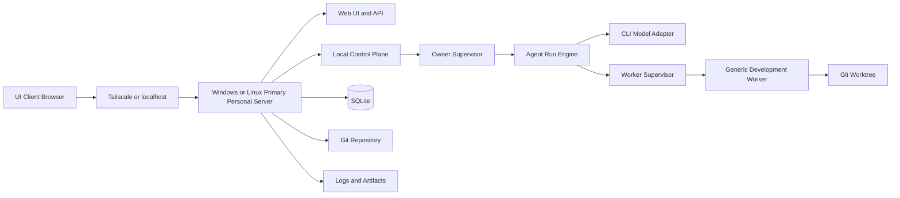

# ADR-0008: 개인 모드 MVP와 배치 구조

## 배경

[[07 ADR/ADR-0005 Personal and Team Runtime Topology]]는 개인 모드와 팀 모드가 하나의 제품이며, 개인 모드에서 Local Control Plane, Owner Runtime, Worker Supervisor, SQLite, Local Git Workspace를 사용한다고 결정했다.

[[07 ADR/ADR-0006 Owner Runtime and Agent Runs]]는 Owner Runtime을 Owner Supervisor와 복구 가능한 Agent Run으로 분리했다. [[07 ADR/ADR-0007 Autonomy and Approval Risk Policy]]는 Owner 자율성을 범위 있는 Grant와 위험 기반 승인으로 제한했다.

이제 팀 모드보다 먼저 구현할 개인 모드 MVP의 범위, 배치 구조, 운영체제 지원, 사용자 흐름과 구현 순서를 확정한다.

## 문제

팀 모드와 중앙 Authority를 먼저 구현하면 개인 사용자가 빠르게 제품 가치를 확인하기 어렵고, Owner Runtime, Worker Supervisor, Tool Call, 승인, Git Worktree 같은 공통 핵심을 작게 검증하기 어렵다.

반대로 개인 모드를 임시 데모로 만들면 이후 팀 모드에서 재사용해야 할 공통 핵심이 버려질 수 있다. 또한 개인 모드 서버를 단일 Ubuntu 배포 대상으로 한정하거나, 데스크톱 앱 우선, 사용자 가입 우선, 여러 Worker Host 우선으로 설계하면 MVP 범위가 커지고 핵심 개발 루프가 늦어진다.

## 결정

첫 번째 실제 제품 구현은 팀 모드가 아니라 개인 모드 MVP다.

개인 모드가 안정화된 뒤 중앙 Authority와 팀 Federation 기능을 추가한다. 개인 모드는 임시 데모가 아니라 이후 팀 모드에서도 재사용되는 공통 핵심을 구현하는 단계다.

첫 구현에서 우선하는 공통 핵심:

- 하나의 앱 UI
- Local Control Plane
- Personal Owner Runtime
- Conversation과 Agent Run
- Tool Call과 승인
- Worker Supervisor
- Generic Development Worker
- Git Workspace와 Worktree
- SQLite
- 로그와 아티팩트
- 프로젝트별 자율성 설정

## MVP 우선순위

개인 모드 MVP는 다음을 먼저 검증한다.

- 사용자가 브라우저에서 Owner와 대화한다.
- Owner가 Task를 계획한다.
- Generic Development Worker가 격리된 Git Worktree에서 작업한다.
- 테스트, 린트, diff, 로그와 아티팩트를 생성한다.
- 사용자가 결과를 검토하고 병합을 승인한다.
- 브라우저 연결이 끊겨도 Primary Personal Server의 SQLite 상태를 기준으로 실행과 복구가 가능하다.

팀 Workspace, 중앙 Authority, PostgreSQL, 여러 Worker Host, 전문 Worker 분리는 개인 모드 안정화 이후 단계로 둔다.

## 기본 배치 구조

개인 모드 MVP의 기본 배치 구조는 UI Client와 Primary Personal Server를 분리한다.

## 운영체제 지원

개인 모드 서버 앱을 단일 Ubuntu 배포 대상으로 한정하지 않는다.

Primary Personal Server Runtime은 다음 운영체제에서 실행 가능하도록 설계한다.

- Windows
- Linux

macOS는 첫 MVP의 공식 지원 범위에 포함하지 않지만 향후 확장을 막지 않는다.

## Ubuntu reference environment

첫 개발, 통합 테스트와 실제 운영의 기준 환경은 Ubuntu Linux다.

이는 Ubuntu만 지원한다는 의미가 아니다.

- Ubuntu는 초기 reference environment
- Windows와 Linux는 제품 지원 목표
- macOS는 후속 확장 후보

## Windows 및 Linux 지원 목표

Runtime 핵심 로직은 운영체제에 종속되지 않아야 한다.

- 경로를 문자열로 직접 조합하지 않고 운영체제 경로 API 사용
- 프로젝트 루트와 데이터 경로를 설정으로 관리
- `/home/...`, `/var/...`, `C:\Users\...`, `C:\ProgramData\...` 경로를 핵심 코드에 고정하지 않음
- Shell 문자열보다 실행 파일과 인수 배열 사용
- 명령 실행 시 명시적인 working directory 사용
- Windows와 Linux의 실행 파일 확장자와 검색 경로 차이 처리
- Windows의 파일 잠금과 경로 길이 차이 고려
- Linux와 Windows의 파일 권한 차이 고려
- 심볼릭 링크와 junction 차이 고려
- 대소문자 구분 차이 고려
- 줄바꿈 형식 차이 고려
- Git Worktree 동작 차이 테스트
- 운영체제별 설치와 서비스 관리를 Adapter로 분리

Linux에서는 systemd 기반 서비스를 우선 검토할 수 있다.

Windows에서는 Windows Service, 사용자 세션 기반 백그라운드 실행, 시작 프로그램 등록을 검토할 수 있다.

구체적인 서비스 설치 기술은 후속 설계로 남긴다.

## 웹 UI

첫 UI는 설치형 Windows 데스크톱 앱이 아니라 Primary Personal Server가 제공하는 웹 UI다.

대표 흐름:

`작업 노트북 브라우저 → Tailscale → Primary Personal Server 웹 앱`

웹 UI를 우선하는 이유:

- 별도 데스크톱 설치와 업데이트 시스템이 필요 없음
- Windows, Linux, 태블릿과 다른 개인 장치에서 접속 가능
- FastAPI 백엔드와 React 프론트엔드를 단순하게 연결 가능
- 동일한 프론트엔드를 이후 Tauri 등으로 포장할 수 있음

Tauri 또는 다른 데스크톱 포장 기술은 후속 과제로 남긴다.

Windows와 Linux의 Primary Personal Server는 동일한 웹 UI와 API를 제공해야 한다.

## 단일 사용자와 가입 기능 후순위

개인 모드 MVP에는 사용자 가입을 구현하지 않는다.

구현하지 않는 항목:

- 사용자 가입
- 이메일 인증
- 비밀번호 재설정
- 공개 회원가입
- 다중 사용자
- 팀 초대

첫 설치 시 로컬 사용자 한 명을 자동 생성한다.

이 사용자는 다음 권한을 가진다.

- 개인 Workspace Admin
- 모든 개인 프로젝트 소유자
- 개인 Owner의 권한 위임자
- 연결된 장치 승인자

향후 사용자 가입, 다중 사용자와 팀 모드를 추가할 수 있도록 내부 데이터 모델에는 다음을 유지한다.

- `users` 엔티티
- `user_id` 참조
- 장치와 사용자 관계
- 프로젝트 소유권
- 세션과 권한 구조
- 사용자별 Owner 관계

사용자를 전역 상수, 하드코딩된 ID 또는 사용자 개념이 없는 구조로 구현하지 않는다.

## Tailscale 전제

개인 모드 MVP의 원격 접속은 Tailscale 네트워크를 기본 전제로 한다.

기본 원칙:

- 인터넷에 직접 공개하지 않음
- 공개 IP와 포트포워딩을 기본 사용하지 않음
- 기본적으로 localhost 또는 Tailscale 인터페이스에서만 접근 허용
- Tailscale 자체가 앱 내부 권한 모델을 완전히 대체하지는 않음
- 연결된 장치와 브라우저 세션을 구분함

Tailscale이 설치되지 않았거나 연결되지 않은 경우에는 같은 Primary Personal Server의 localhost 접근만 허용할 수 있다.

Tailscale 설치, 계정 가입과 로그인 자동화는 첫 MVP의 필수 범위가 아니다. 사용자가 Tailscale을 미리 설치하고 구성했다고 가정한다.

## 최초 장치 연결

사용자 가입 기능은 없지만, Tailscale에 연결된 모든 장치를 앱에 자동 로그인시키지는 않는다.

최초 장치 연결 흐름:

1. Primary Personal Server가 일회용 연결 코드를 생성한다.
2. 사용자가 UI Client의 브라우저에서 연결 코드를 입력한다.
3. 서버가 해당 장치 또는 브라우저 세션용 토큰을 발급한다.
4. 이후 해당 장치는 자동 로그인 가능하다.
5. 설정 화면에서 연결된 장치와 세션을 확인한다.
6. 설정 화면에서 장치 토큰 또는 세션을 폐기할 수 있다.

연결 코드 특성:

- 짧은 유효시간
- 한 번 사용하면 폐기
- 로그에 원문을 장기 저장하지 않음
- 반복 실패 제한
- 승인된 장치 토큰과 분리
- 코드 재사용 방지

구체적인 토큰 형식, 암호 알고리즘, 세션 저장 방식과 만료 시간 수치는 후속 보안 설계로 남긴다.

## Primary Personal Server

Primary Personal Server에서 다음을 실행한다.

- 웹 프론트엔드 정적 파일 제공
- Local Control Plane
- Owner Supervisor
- Agent Run Engine
- Model Provider Adapter
- Worker Supervisor
- Generic Development Worker
- SQLite
- Git Repository와 Worktree
- 로그
- 아티팩트
- 백그라운드 작업

UI Client가 종료되거나 브라우저 연결이 끊겨도 Primary Personal Server에서 승인 대기 전까지 작업을 계속할 수 있다.

개인 모드 MVP에서는 하나의 Primary Personal Server를 사용한다. 여러 노트북, 태블릿 또는 브라우저 장치가 이 서버에 UI Client로 접속할 수 있다.

첫 MVP에서 구현하지 않는 항목:

- 여러 Personal Node 사이의 작업 분산
- 추가 Worker Host 등록
- 여러 실행 서버의 스케줄링
- 실행 서버 장애 조치
- 서버 간 Scope Lock
- 여러 DB 간 동기화
- 여러 컴퓨터의 CPU 또는 GPU 통합 실행

향후 개인 사용자가 여러 Windows 또는 Linux 컴퓨터를 Worker Host로 추가할 수 있도록 확장 가능성은 유지한다.

## 프로젝트 가져오기

개인 모드 MVP의 프로젝트 추가 기능은 다음 순서로 구현한다.

1. Primary Personal Server에 이미 존재하는 Git 저장소 가져오기
2. Git URL로 Clone
3. 빈 프로젝트 생성

1단계에서는 사용자가 허용된 프로젝트 루트 아래에 있는 Git 저장소를 선택하거나 경로를 입력한다.

문서 예시:

- Linux: `/home/<user>/projects/my-project`
- Windows: `C:\Users\<user>\Projects\my-project`

문서 예시를 제외하고 특정 운영체제 경로를 코드에 고정하지 않는다.

보안 원칙:

- 설정된 허용 프로젝트 루트 밖의 임의 경로는 기본적으로 가져오지 않음
- 경로 정규화
- Path traversal 검사
- 심볼릭 링크 또는 junction 검사
- 저장소 유효성 검사
- 기존 작업 트리 변경 상태 확인
- 사용자가 가져올 저장소와 권한을 검토
- 프로젝트 루트와 실제 경로를 Canonical Path 기준으로 비교

Git URL Clone 단계에서는 인증 정보와 비밀키를 로그나 모델 Context에 직접 노출하지 않는다.

빈 프로젝트 생성은 첫 번째 프로젝트 가져오기 기능보다 후순위다.

## Git Worktree 격리

Worker는 사용자의 기본 작업 디렉터리를 직접 수정하지 않는다.

각 Task 또는 Task Attempt에 대해 별도의 Git Worktree와 작업 브랜치를 사용한다.

기본 흐름:

1. Owner가 Task 생성
2. Worker Supervisor가 Task Attempt 생성
3. 별도 Worktree와 브랜치 준비
4. Worker가 해당 Worktree에서만 파일 수정
5. 테스트, 포맷터와 린터 실행
6. Git diff와 실행 증거 생성
7. Owner가 결과 검토
8. 사용자에게 결과와 Diff 표시
9. 승인되면 로컬 통합 또는 기본 브랜치 반영
10. 완료 후 Worktree 정리

기본 프로젝트 작업 디렉터리의 미커밋 변경을 Worker가 덮어쓰지 않아야 한다.

Worktree 생성 실패, 충돌, dirty 상태, 파일 잠금 문제 또는 운영체제별 제약을 사용자에게 명확하게 보고한다.

Windows와 Linux 양쪽에서 Worktree 경로 길이, 파일 잠금, 대소문자 구분, 줄바꿈, 실행 권한, 심볼릭 링크, Git 실행 파일 경로를 고려한다.

## Model Provider Adapter

Model Provider Adapter는 API 방식과 CLI 방식을 모두 지원할 수 있는 인터페이스로 설계한다.

개인 모드 MVP의 첫 구현은 CLI Adapter다. 이후 API Adapter를 추가할 수 있어야 한다.

지원 방향:

- Codex CLI Adapter
- Gemini CLI Adapter
- Generic Command Adapter
- 미래의 API Adapter

실제 첫 Adapter 종류는 구현 시작 시 선택할 수 있지만 공통 인터페이스를 먼저 정의한다.

## CLI-first Adapter

CLI Adapter 책임:

- 설정된 CLI 실행 파일 호출
- 지정된 작업 디렉터리에서 실행
- stdin, stdout, stderr 관리
- Agent Run과 프로세스 연결
- 실행 취소
- timeout
- 종료 코드 기록
- 출력 스트리밍
- 모델 또는 CLI 종류 기록
- 실패 원인 분류
- 재시작 후 실행 결과를 복구할 수 있는 기록 남기기
- 운영체제별 실행 파일 탐색
- `.exe`, `.cmd`, `.bat`와 Linux 실행 파일 차이 처리
- 환경 변수 전달
- CLI 버전 확인

CLI 도구의 로그인은 앱 밖에서 사용자가 미리 완료할 수 있다.

MVP가 각 CLI 공급자의 다음 기능을 직접 구현하지 않는다.

- 계정 가입
- 구독 상태 관리
- 결제
- OAuth 로그인
- 사용량 구매

CLI Adapter는 특정 도구 하나에 Owner Runtime 전체를 결합하지 않는다.

CLI 출력 문자열을 제품의 공식 도메인 상태로 직접 사용하지 않는다. 가능하면 구조화된 결과 형식이나 Adapter 정규화 계층을 사용한다.

CLI 명령과 인수는 안전한 인수 배열로 실행한다. 사용자 입력을 하나의 Shell 문자열로 조합하지 않는다.

명령 실행은 운영체제에 관계없이 가능한 한 다음 구조를 사용한다.

- executable
- argument array
- working directory
- environment variables
- timeout
- cancellation token

### Owner-led Worker Model과 AGY Alpha

- Personal Mode MVP follows an Owner-led Worker model. User communicates with Owner; Worker receives Task instructions. General free-form Worker prompts are not part of MVP.
- AGY CLI is the first verified real CLI Worker Alpha. AGY Alpha is opt-in, controlled, and skipped by default in normal tests.
- CLI Adapter must support non-interactive background execution.
- Process Runner closes stdin for background workers (e.g., tying `stdin` to `subprocess.DEVNULL`) to prevent hangs during non-interactive execution.

## Generic Development Worker

첫 MVP에서는 여러 전문 Worker를 만들지 않고 하나의 Generic Development Worker로 시작한다.

지원 Capability:

- 프로젝트와 코드 읽기
- 허용된 Worktree 안에서 파일 수정
- 파일 생성
- 안전한 명령 실행
- 포맷터 실행
- 린터 실행
- 테스트 실행
- Git status와 diff 생성
- 로컬 commit 후보 생성
- 결과 요약
- 실패와 미완료 작업 보고

첫 MVP에서 분리하지 않는 Worker:

- 별도 Test Worker
- Review Worker
- Documentation Worker
- Image Worker
- Audio Worker
- Deployment Worker

아키텍처에서는 Worker Capability 개념을 유지하여 안정화 후 전문 Worker로 분리할 수 있게 한다.

## 기본 승인 정책

개인 모드의 기본 자율성 프로필은 `Allow Local Work`다.

기본 자동 허용:

- R0 읽기 전용 작업
- 허용된 프로젝트와 Worktree 안의 R1 파일 수정
- 새 파일 생성
- 로컬 테스트
- 포맷터
- 린터
- 작업 브랜치 생성
- 작업 브랜치의 로컬 commit 후보
- Git diff와 결과 보고

기본 승인 필요:

- 기본 브랜치 또는 사용자의 실제 작업 브랜치에 병합
- 대량 파일 삭제
- 프로젝트 외부 경로 변경
- 시스템 패키지 설치
- 서버 설정 변경
- 서비스 재시작
- 비밀정보 사용
- 외부 시스템에 데이터 전송
- 배포
- 유료 API 또는 클라우드 자원 사용
- Git remote 변경
- remote push
- 보호 설정 변경

ADR-0007의 Owner Grant와 위험 정책을 따른다. R4 행동은 모든 프로필에서 명시적 사용자 승인이 필요하다.

## 프로젝트별 자율성 설정

사용자는 프로젝트별로 자율성 수준을 변경할 수 있다.

지원할 프로필 방향:

- Confirm Every Change
- Allow Local Work
- Trusted Owner
- Autonomous

MVP에서는 최소한 다음 두 프로필을 구현한다.

- Confirm Every Change
- Allow Local Work

Trusted Owner와 Autonomous는 내부 데이터 모델과 UI 확장성을 유지하면서 후속 구현할 수 있다.

단순한 `full_access` Boolean을 사용하지 않는다.

## SQLite

개인 모드의 공식 상태는 Primary Personal Server의 SQLite에 저장한다.

저장 대상:

- 로컬 사용자
- 연결된 장치와 세션
- 프로젝트
- 프로젝트 설정
- Conversation과 Message
- Agent Run과 Step
- Tool Call
- Work Item
- Task와 Task Attempt
- Worker Run
- Owner Grant
- Approval Request와 Decision
- Git Worktree 메타데이터
- 로그와 아티팩트 참조
- Runtime Event
- 로컬 감사 기록

대형 로그, 바이너리 아티팩트와 프로젝트 파일 본문은 SQLite에 직접 모두 저장하지 않는다. 파일 저장소에 두고 SQLite에는 참조를 저장할 수 있다.

SQLite DB, 로그, 아티팩트와 프로젝트 저장소의 백업 정책은 후속 설계로 남긴다.

SQLite 경로는 운영체제별 기본 데이터 경로 Resolver 또는 설정을 통해 결정한다.

## 백그라운드 실행

Primary Personal Server에서 Owner와 Worker 작업은 브라우저 연결이 끊겨도 계속될 수 있다.

다음 상태에서는 실행을 멈추고 기다린다.

- 사용자 승인 필요
- 추가 사용자 입력 필요
- CLI 로그인 만료
- 복구할 수 없는 Worker 오류
- 위험 정책 위반
- Emergency Stop

브라우저가 다시 연결되면 SQLite의 현재 상태를 읽어 화면을 복구한다. 실행 상태의 원본은 브라우저 메모리가 아니라 SQLite다.

## MVP 제외 범위

첫 MVP에서 제외한다.

- 사용자 가입
- 이메일 인증
- 비밀번호 재설정
- 다중 사용자
- 중앙 Authority
- 팀 Workspace
- 팀 멤버십
- Approval Group
- 팀 Merge Queue
- PostgreSQL
- 여러 Worker Host
- 여러 실행 서버의 작업 분산
- 모바일 전용 앱
- 데스크톱 패키징
- 자동 Tailscale 설치
- 고가용성
- Enterprise SSO
- 결제와 사용량 청구
- 전문 Worker 분리
- 중앙 Coordination AI
- macOS 공식 지원
- 운영체제별 자동 업데이트 시스템

사용자 가입과 다중 사용자 기능은 개인 모드 안정화 이후 또는 팀 모드 구현 단계에서 추가한다.

## 데이터 모델 방향

개인 모드 MVP의 SQLite 후보:

- local_users
- connected_devices
- device_sessions
- projects
- project_settings
- owner_conversations
- owner_messages
- agent_runs
- agent_run_steps
- tool_calls
- work_items
- tasks
- task_attempts
- worker_runs
- owner_grants
- approval_requests
- approval_decisions
- git_worktrees
- runtime_events
- security_audit_events
- artifact_refs

구체적인 전체 스키마와 인덱스는 후속 데이터 모델 설계로 남긴다.

## 장점

- 팀 모드보다 작은 범위에서 공통 핵심을 검증한다.
- 브라우저 기반 UI로 Windows, Linux와 다른 개인 장치 접근을 단순화한다.
- Tailscale 전제로 인터넷 직접 공개와 포트포워딩을 피한다.
- CLI-first Adapter로 초기 모델 연결을 단순화하면서 API Adapter 확장을 열어 둔다.
- Generic Development Worker 하나로 Worker 아키텍처를 작게 시작한다.
- Worktree 격리로 사용자의 기본 작업 디렉터리를 보호한다.

## 단점

- Primary Personal Server 설치와 Tailscale 사전 구성이 필요하다.
- CLI 로그인과 구독 관리를 앱 안에서 해결하지 않는다.
- Windows와 Linux의 Git Worktree, 경로, 프로세스 차이를 테스트해야 한다.
- 데스크톱 앱처럼 보이는 설치 경험은 후속 과제로 남는다.
- 여러 Worker Host나 전문 Worker가 필요한 사용 사례는 MVP 이후로 미뤄진다.

## 후속 과제

- 첫 번째 실제 CLI Adapter 종류 선택
- CLI별 구조화된 출력 방식 정의
- 장치 토큰 형식과 만료 정책 정의
- 허용 프로젝트 루트의 운영체제별 기본 경로 정의
- 브랜치와 Worktree 명명 규칙 정의
- Git commit을 기본 자동 허용할지 후보 상태로만 둘지 결정
- 병합 방식 결정: merge, squash, rebase
- SQLite 백업 방식 정의
- 로그와 아티팩트 보존 기간 정의
- Emergency Stop의 정확한 종료 범위 정의
- 새 v2 저장소 이름과 생성 방식 결정
- 프론트엔드 세부 라이브러리 결정
- 추가 Worker Host 도입 시점 결정
- Windows Service 구현 방식 정의
- Linux systemd 설치 방식 정의
- 자동 업데이트 방식 정의
- macOS 지원 시점 검토
