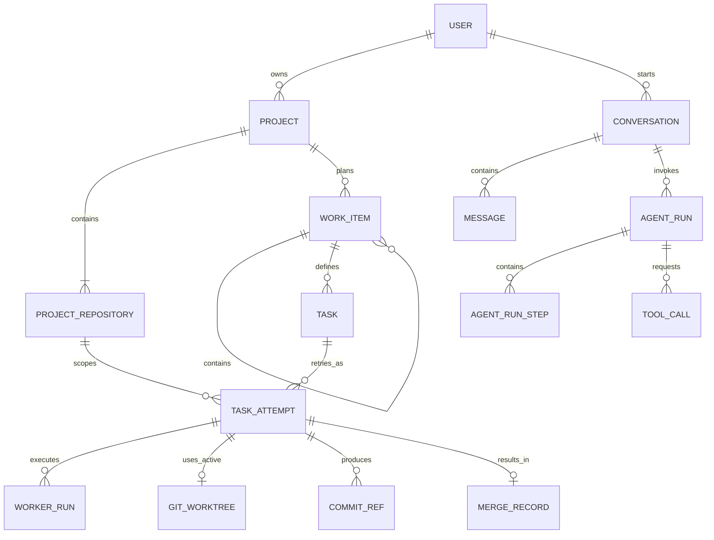
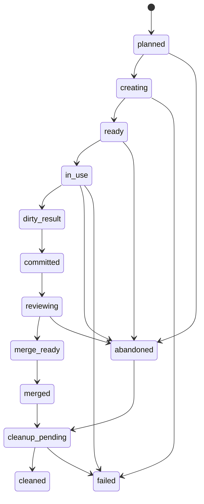
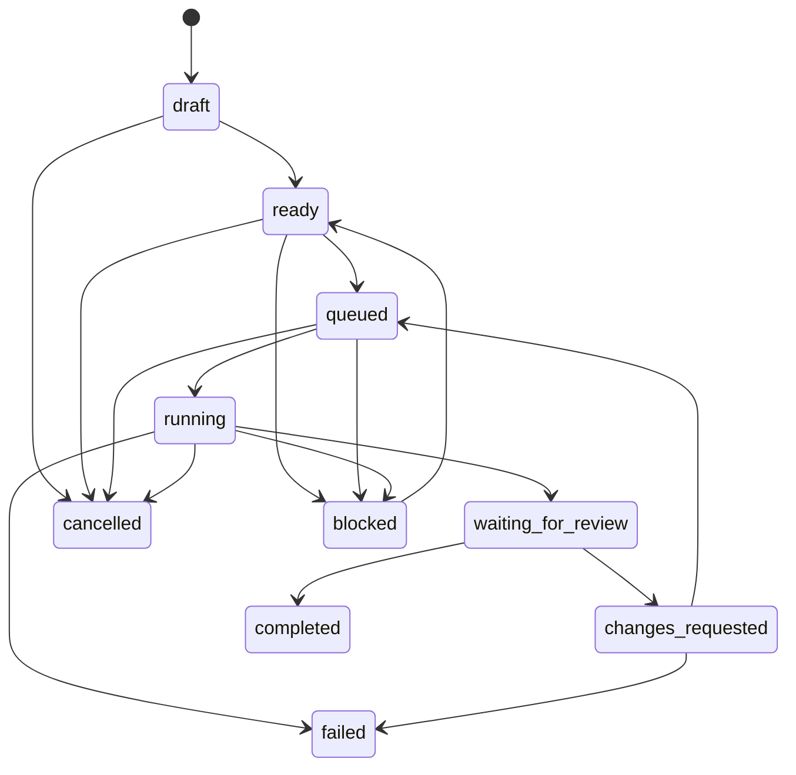
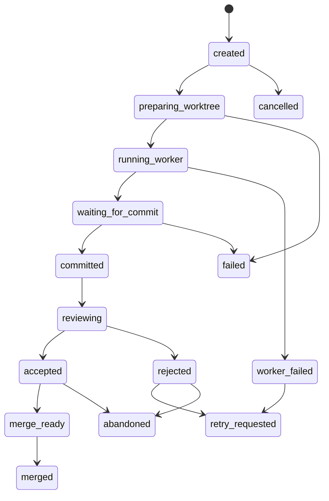
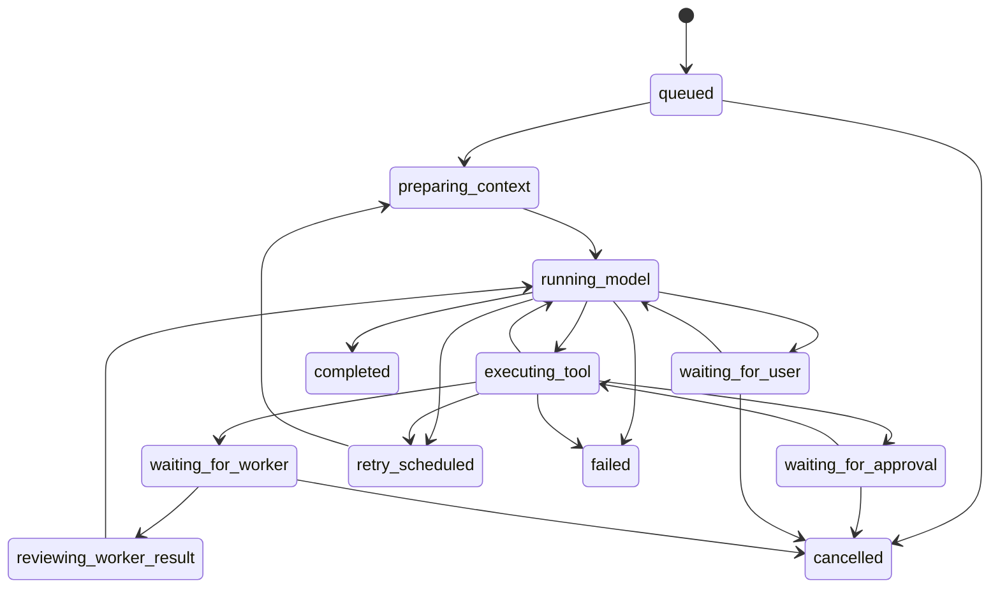

# ADR-0009: Personal Mode 핵심 데이터 모델과 상태 머신

## 배경

[[07 ADR/ADR-0006 Owner Runtime and Agent Runs]]는 Conversation, Agent Run, Tool Call과 복구 가능한 Owner Runtime의 경계를 정했고, [[07 ADR/ADR-0007 Autonomy and Approval Risk Policy]]는 Owner Grant와 위험 기반 승인 정책을 정했다. [[07 ADR/ADR-0008 Personal Mode MVP and Deployment]]는 Windows와 Linux를 대상으로 Primary Personal Server, SQLite, Git Worktree, Owner 검토와 사용자 승인 흐름을 Personal Mode MVP로 채택했다.

이 ADR은 그 결정을 변경하지 않고, [[01 Product/Personal Mode MVP]]와 [[09 Roadmap/Personal Mode MVP Roadmap]]을 구현할 때 필요한 핵심 관계, 저장소 경계와 상태 전이를 구체화한다.

## 문제

Project와 Git Repository, Conversation과 실행, 사람이 보는 계획과 Worker 실행 기록을 구분하지 않으면 다음 문제가 생긴다.

- 여러 repository를 가진 Project를 나중에 수용하기 어렵다.
- 대화 기록, 복구할 실행 상태와 장기 Memory가 섞인다.
- Task 재시도가 이전 실행 증거를 덮어쓴다.
- Worker 결과와 기본 브랜치의 공식 이력이 혼합된다.
- SQLite 상태와 Git 상태 중 어느 쪽이 원본인지 불분명해진다.
- dirty repository, stale base commit, 승인 대기와 실패를 일관되게 복구하기 어렵다.
- Owner LLM이 제어 계층을 우회해 상태를 직접 변경할 위험이 생긴다.

## 결정

### Project와 repository

- Project는 하나 이상의 `ProjectRepository`를 가지며 여러 Git Repository를 포함할 수 있다.
- 개인 모드와 팀 모드의 공통 도메인 모델은 multi-repository project를 허용한다.
- Personal Mode MVP의 첫 실행 흐름은 `primary` repository 중심으로 단순화한다.
- repository role은 `primary`, `supporting`, `docs`, `infra`, `unknown`을 기본 후보로 둔다.
- Task, Task Attempt, Worktree, Branch와 Commit 기록은 소속 repository를 반드시 추적한다.
- MVP에서는 cross-repository atomic transaction과 multi-repo merge orchestration을 구현하지 않는다.
- 여러 repository를 변경하는 작업은 여러 Task 또는 repository 범위가 분리된 여러 Task Attempt로 표현한다.

```text
Project
└─ ProjectRepository
   ├─ role: primary | supporting | docs | infra | unknown
   ├─ local_path
   ├─ remote_url
   ├─ default_branch
   └─ status
```

### Work Item, Task와 Task Attempt

```text
Project
└─ Work Item
   ├─ child Work Item
   └─ Task
      └─ Task Attempt
```

- Work Item은 사람이 보는 목표, 기능, 버그, 조사 또는 개선 단위이며 자유로운 부모·자식 트리를 가진다.
- Task는 Owner가 Worker에게 맡기기 위해 만드는 실행 단위다.
- Worker는 할당된 Task 범위 안에서만 실행하며, Task 없이 독립적으로 실행하거나 제품 목표와 작업 단위를 임의로 정의하지 않는다.
- Task Attempt는 Task의 실제 한 번의 실행 기록이다. 같은 Task에 여러 Attempt가 있을 수 있고 재시도는 기존 Attempt를 덮어쓰지 않는다.

Task는 최소한 다음 성격의 필드를 가진다.

- `task_id`, `work_item_id`, `project_id`, `repository_id`
- `created_by_owner_run_id`, `title`, `goal`, `success_criteria`
- `read_scope`, `write_scope`, `forbidden_scope`, `required_capabilities`
- `risk_level`, `status`, `created_at`, `updated_at`

Task Attempt는 최소한 다음 성격의 필드를 가진다.

- `attempt_id`, `task_id`, `repository_id`, `worker_run_id`, `assigned_worker_id`
- `model_provider`, `model_name`, `cli_adapter`
- `base_commit_sha`, `worktree_id`, `branch_name`, `status`
- `started_at`, `completed_at`, `final_commit_sha`, `squash_commit_sha`
- `diff_ref`, `test_evidence_ref`, `artifact_refs`
- `failure_category`, `failure_message`

### Conversation과 Agent Run

- Conversation은 채팅 기록 단위이며 Project에 속하거나 일반 대화로 존재할 수 있다.
- 하나의 Project에는 여러 Conversation이, 하나의 Conversation에는 여러 Agent Run이 있을 수 있다.
- Agent Run은 하나의 명확한 사용자 요청 또는 시스템 목적을 처리하는 실행 단위다.
- 사용자가 일반 대화 중 수정, 생성, 테스트, 분석 또는 병합 준비를 요청하면 Owner는 Agent Run을 만들고, 필요한 경우 Work Item이나 Task를 생성한다.
- Conversation History, Run State와 Long-term Memory는 서로 다른 저장 개념으로 유지한다.

```text
Conversation
├─ Message
├─ Agent Run
│  ├─ Agent Run Step
│  ├─ Tool Call
│  ├─ Approval Interruption
│  └─ Created Task
└─ Linked Work Item / Task / Attempt
```

### Owner Tool Boundary

Owner LLM은 SQLite, Git, 파일시스템 또는 Worker를 직접 조작하지 않는다. 관찰, 상태 변경, Task 생성, Worker 할당, 결과 검토, 승인 요청과 병합 준비는 Local Control Plane 또는 Personal Server가 제공하는 명시적 Tool Call로만 수행한다.

Tool Call 실행 전에는 권한 검사, 위험도 평가, [[07 ADR/ADR-0007 Autonomy and Approval Risk Policy|Approval Policy와 Owner Grant]] 평가가 이루어져야 한다. 외부 부작용 Tool Call은 idempotency key와 감사 기록을 가져야 한다. Owner는 자신의 권한을 확대하거나 이 경계를 우회할 수 없다.

금지하는 구조:

```text
Owner LLM → SQLite 직접 수정
Owner LLM → Git 직접 실행
Owner LLM → 파일시스템 직접 변경
Owner LLM → Worker 직접 실행
```

허용하는 구조:

```text
Owner LLM
→ Tool Call
→ Local Control Plane / Personal Server
→ 권한 검사와 위험도 평가
→ SQLite / Git / File System / Worker Supervisor
→ Runtime Event / Audit Event 기록
```

## 핵심 엔티티

Personal Mode MVP의 SQLite 핵심 엔티티 후보는 다음과 같다. 실제 이름, 컬럼 타입, 인덱스와 DDL은 후속 설계로 남긴다.

| 영역 | 엔티티 후보 | 책임 |
|---|---|---|
| 사용자와 장치 | `users`, `user_devices` | 로컬 사용자와 연결 장치 관계 |
| 프로젝트 | `projects`, `project_repositories` | Project와 Git Repository 메타데이터 |
| 대화와 실행 | `conversations`, `messages`, `agent_runs`, `agent_run_steps`, `tool_calls` | 대화 기록과 복구 가능한 Owner 실행 |
| 계획과 실행 | `work_items`, `tasks`, `task_attempts`, `worker_runs` | 목표, Worker 실행 단위와 실행 증거 |
| Git 메타데이터 | `git_worktrees`, `branch_refs`, `commit_refs`, `merge_records` | Worktree, branch, commit와 merge 참조 |
| 권한과 승인 | `approval_requests`, `approval_decisions`, `owner_grants` | 정책 평가 대상과 승인 결과 |
| 이벤트와 산출물 | `runtime_events`, `artifact_refs`, `audit_events` | 복구 이벤트, 외부 산출물 참조와 감사 |

## 관계 모델

- User 1:N Project
- User 1:N Conversation
- Project 1:N ProjectRepository
- Project 1:N WorkItem
- WorkItem 1:N child WorkItem
- WorkItem 1:N Task
- Task 1:N TaskAttempt
- TaskAttempt 1:1 또는 1:N WorkerRun
- TaskAttempt N:1 ProjectRepository
- TaskAttempt 1:1 active GitWorktree
- Conversation 1:N Message
- Conversation 1:N AgentRun
- AgentRun 1:N AgentRunStep
- AgentRun 1:N ToolCall
- AgentRun은 WorkItem, Task 또는 ApprovalRequest를 생성할 수 있다.
- ApprovalRequest는 ToolCall, TaskAttempt 또는 MergeRecord를 참조할 수 있다.
- MergeRecord는 ProjectRepository, TaskAttempt, base commit, head commit과 squash commit을 참조한다.



## 상태 머신

상태 전이는 Runtime Event와 Audit Event로 추적한다. 상태 이름은 저장된 공식 상태이며 UI 문구와 동일할 필요는 없다.

### Git Worktree



`planned`는 Attempt 생성, `creating`은 Worktree 생성 중, `ready`는 생성 완료, `in_use`는 Worker 실행 중이다. 변경이 생겼으나 commit 전이면 `dirty_result`, 작업 브랜치 commit 후에는 `committed`, Owner 검토 중에는 `reviewing`, 승인 요청 또는 병합 준비가 끝나면 `merge_ready`가 된다. Squash merge 후 `merged`, 실패하거나 사용자가 폐기하면 `abandoned`, 정리 예약과 삭제 완료는 각각 `cleanup_pending`, `cleaned`다. 생성·실행·정리 자체의 오류는 `failed`로 기록한다.

### Task



`blocked`는 의존성, dirty repository, 권한 부족 또는 승인 대기 등으로 진행할 수 없는 상태다. `completed`는 승인된 결과가 반영됐거나 사용자가 완료로 인정한 상태다. `failed`는 복구 불가능하거나 재시도를 중단한 상태이며, 개별 Attempt 실패가 곧바로 Task 실패를 뜻하지는 않는다.

### Task Attempt



Attempt는 한 번의 실행 기록이다. `accepted`는 Owner 검토 통과, `merged`는 기본 브랜치 반영 완료를 뜻한다. `rejected` 또는 `retry_requested` 이후의 실행은 새 Attempt로 기록한다. 실패, 취소와 폐기 기록도 보존한다.

### Agent Run

ADR-0006의 후보 상태를 다음과 같이 구체화한다.



Agent Run은 Conversation과 다른 요청별 실행 상태다. 승인 대기와 Worker 대기는 실패가 아니다. 재시작 후 SQLite 상태로 미완료 Run을 복구하며, 이미 성공한 외부 부작용 Tool Call은 idempotency key와 저장된 결과를 확인해 무조건 반복하지 않는다.

## Git Worktree와 Branch 생명주기

1. Task Attempt가 repository와 `base_commit_sha`를 고정한다.
2. Local Control Plane이 repository별 dirty 상태와 경로 정책을 검사한다.
3. 허용된 worktree root 아래에 격리 Worktree와 작업 브랜치를 만든다.
4. Worker는 할당된 Task의 `write_scope` 안에서만 실행한다.
5. Worker는 Attempt 결과를 작업 브랜치에 자동 commit한다. 이는 기본 브랜치에 영향을 주지 않는 복구·비교 가능한 산출물이다.
6. Owner가 diff, 테스트 증거, 실패 기록, scope 위반, 위험도와 stale base를 검토한다.
7. 승인 정책 통과와 사용자 승인 후 하나의 squash commit으로 기본 브랜치에 반영한다.
8. 결과와 참조를 보존한 뒤 Worktree를 정리한다.

Personal Mode MVP의 자동 commit 기본값은 켜짐이다. 프로젝트별 비활성화 설정은 후속 확장으로 남긴다. Merge commit과 rebase + fast-forward도 후속 고급 설정 후보로 남긴다.

기존 repository가 dirty여도 Project 등록과 읽기·분석은 허용한다. 그러나 해당 repository에서 Worker 작업 시작은 차단하며 앱이 사용자 변경을 자동 commit하거나 stash하지 않는다. 사용자가 commit, stash 또는 폐기 등으로 직접 정리해야 한다. 다른 clean repository 작업까지 차단할지는 후속 정책으로 남긴다.

## Commit과 Merge 경계

- Git은 코드, commit, branch와 merge history의 원본이다.
- SQLite는 실행 상태, Attempt, 승인, Tool Call, Worker Run, Worktree metadata, artifact 참조와 감사 기록의 원본이다.
- Worker commit은 작업 브랜치의 산출물이고, squash merge commit은 기본 브랜치의 공식 반영 기록이다.
- Task Attempt는 `base_commit_sha`, `final_commit_sha`, `squash_commit_sha`를 연결할 수 있어야 한다.
- `base_commit_sha`가 stale이면 Owner 검토 또는 merge 준비 단계에서 다시 검증한다.
- 충돌은 자동으로 강행하거나 임의 해결하지 않는다. Task는 `changes_requested` 또는 `blocked`, Attempt는 `retry_requested`로 전환할 수 있다.

Worker는 기본 브랜치에 병합할 수 없고 작업 브랜치 commit과 Attempt 결과 생성까지만 담당한다. Owner는 검토자이자 병합 준비자이며 Approval Policy와 Owner Grant를 우회할 수 없다. Personal Mode MVP 기본 자율성 프로필에서는 기본 브랜치 반영에 사용자의 최종 승인이 필요하다.

```text
Worker = 실행자
Owner = 검토자 + 병합 준비자
Approval Policy = 승인 필요 여부 판단
User = Personal Mode MVP 기본 브랜치 반영 최종 승인자
```

## 실패와 재시도

실패 유형은 최소한 다음 범주를 표현할 수 있어야 한다.

- `dirty_repository`, `worktree_create_failed`, `branch_create_failed`
- `worker_process_failed`, `command_failed`, `test_failed`, `lint_failed`, `commit_failed`
- `scope_violation`, `policy_denied`, `approval_denied`
- `merge_conflict`, `stale_base_commit`, `timeout`, `cancelled`, `unknown_error`

재시도는 기존 Attempt를 초기화하지 않는다. 새 Attempt를 만들거나 동일 Agent Run의 명시적인 재개 가능 지점에서 재개한다. 외부 부작용이 완료된 Tool Call은 idempotency key로 중복 실행을 피한다. base commit이 바뀌면 새 Attempt에 기록하며, 실패한 Attempt의 로그, diff와 artifact ref를 보존한다. 재시도 횟수, backoff와 timeout 값은 후속 정책이다.

## 무결성 규칙

- Project는 하나 이상의 ProjectRepository를 가지며, MVP에서는 `primary` repository가 하나 이상 필요하다.
- ProjectRepository는 정확히 하나의 Project에 속한다.
- Task와 Task Attempt는 실행 대상 repository를 명시한다.
- cross-repository 변경을 하나의 거대한 암묵적 실행으로 처리하지 않는다.
- Worker는 Task 없이 실행되지 않으며 기본 브랜치에 직접 merge할 수 없다.
- 하나의 active Task Attempt는 하나의 active GitWorktree를 가지며 Worktree는 하나의 repository에 속한다.
- Worker는 허용된 Worktree와 `write_scope` 밖을 수정할 수 없다.
- Worktree path는 허용된 project root 또는 worktree root 아래여야 하며 path traversal과 symlink/junction escape를 금지한다.
- `cleaned` Worktree는 새 Worker 실행에 재사용하지 않는다.
- `merged` 또는 `abandoned` Worktree와 작업 브랜치에는 새 commit을 추가하지 않는다.
- Owner는 Tool Call 없이 SQLite, Git, 파일 또는 Worker를 직접 조작하지 않는다.
- Approval Policy와 Owner Grant는 Tool Call 실행 전에 평가하며 R4 행동은 자동 실행하지 않는다.
- dirty repository에서는 해당 repository의 Worker 작업 시작을 차단한다.
- Approval은 action, tool arguments, repository, base commit과 변경 범위에 묶인다.
- 승인 후 base commit, 대상 파일, 위험도 또는 tool arguments가 바뀌면 승인을 stale로 처리할 수 있어야 한다.
- 실패와 재시도는 이전 기록을 덮어쓰지 않는다.

## 개인 모드 MVP 범위

포함한다.

- SQLite 기반 공식 실행 상태
- ProjectRepository와 primary repository 중심 실행
- Work Item, Task와 Task Attempt
- Conversation과 Agent Run 분리
- Owner Tool Boundary
- repository별 dirty check
- Task Attempt별 Git Worktree와 작업 브랜치
- Worker 작업 브랜치 자동 commit
- Owner 검토와 사용자 승인 후 squash merge
- 실패와 재시도 기록
- Runtime Event와 Audit Event

제외하거나 후순위로 둔다.

- cross-repository atomic merge와 multi-repo merge queue
- 중앙 Authority 기반 공식 팀 merge와 PostgreSQL 공유 상태
- Approval Group 기반 팀 승인
- 자동 conflict resolution
- 복잡한 branch strategy 고급 설정
- 자동 commit 비활성화 UX
- artifact retention 고급 정책

## 팀 모드 확장 방향

팀 모드에서도 ProjectRepository, Work Item, Task, Task Attempt, Agent Run과 Approval 모델을 재사용한다. 중앙 Authority와 PostgreSQL이 공식 공유 상태를 소유하며 Personal Node의 SQLite는 중앙 상태의 동등한 writer가 아니다.

팀 모드에는 Merge Coordinator, Approval Group, Approval Policy와 중앙 Merge Queue가 추가된다. Personal Mode의 Owner 검토와 사용자 승인은 팀 모드에서 Approval Group과 Merge Coordinator로 확장된다. multi-repository project는 여러 repository를 가진 실제 제품 개발 구조를 지원하기 위한 선행 결정이다.

## 장점

- Personal Mode MVP 구현에 필요한 관계와 복구 가능한 상태가 명확해진다.
- Git과 SQLite의 소유권이 분리되어 실행 기록과 코드 이력을 각각 적합한 저장소에서 관리한다.
- 실패와 재시도 증거를 보존하면서 Worker 결과를 격리한다.
- primary repository 중심으로 작게 시작하면서 multi-repository 확장을 막지 않는다.
- Owner, Worker, Approval Policy와 Human 사용자의 역할 경계를 유지한다.

## 단점

- 상태 머신과 참조 엔티티가 늘어 초기 구현 복잡도가 높다.
- SQLite 상태와 Git 실제 상태의 reconciliation이 필요하다.
- Worktree 정리, stale base와 중단된 commit 복구를 운영체제별로 검증해야 한다.
- cross-repository 작업과 conflict UX는 아직 완결되지 않는다.

## 후속 과제

- multi-repository 작업의 원자적 병합과 Change Package 설계
- repository별 dirty 상태가 다른 repository 작업을 차단하는 범위
- 자동 commit 비활성화 옵션의 UX
- merge conflict 재시도 UX
- artifact 보존 기간과 용량 정책
- 정확한 SQLite DDL, 인덱스와 상태 전이 제약
- 팀 모드 Approval Group과 Merge Coordinator의 세부 상태 머신
- Agent Run과 Task의 재시도 횟수, backoff와 timeout
- Personal Server 설치 방식: Linux systemd, Windows Service 또는 사용자 세션 실행

## 관련 문서

- [[01 Product/Personal Mode MVP]]
- [[02 Architecture/System Context]]
- [[02 Architecture/Data Ownership]]
- [[03 Domain Model/Domain Model]]
- [[05 Database/Database Strategy]]
- [[09 Roadmap/Personal Mode MVP Roadmap]]
- [[10 Open Questions/Open Questions]]

